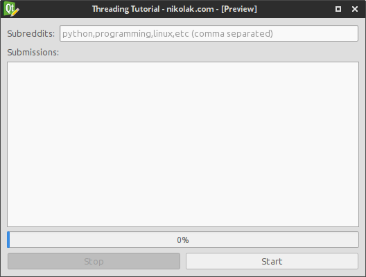
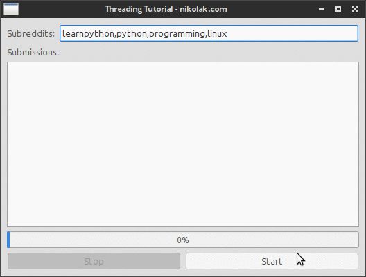
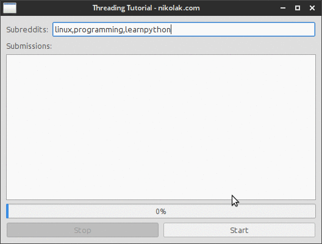

# PyQt: Threading Basics Tutorial

`Blog LogoNikola Kovacevic on 06 Aug 2015, tags: pyqt, tutorial, beginner, qthread, threading, pyqt thread`


I've written about Getting started with PyQt in one of my previous blog posts, and the post covers the basics of getting Qt Designer and PyQt in general up and running - check it out if you haven't already. However an important thing missing from that post is threading and how to do it in PyQt.  

If you're just looking for final commented code and not a step by step tutorial for beginners click here.  

Note: This tutorial assumes you're at least familiar with the things mentioned in the previous "Getting started with PyQt" tutorial, and that you have basic understanding of what threads are and how they work.  

In this post I'll write a simple app that fetches top posts from few different subreddits (subsections of reddit.com) while following API rules of 1 request per 2 seconds to illustrate the issues you encounter if you try to do it all in one thread. The design will be simple as that's not the main point of the post, and the backend will only use modules built into python (and PyQt of course) to reduce number of 3rd party dependencies required.  

## Final project goal:  

### App Description
- Allow user to enter n number of subreddit names into an line edit field, separated by a comma.
- Have a list where post titles will be displayed.
- Have a progress bar that updates as the number of fetched subreddits increases.
- Allow user to cancel the updating at any time.

### App Design
The design is going to be simple and not a focus of this tutorial. Here's the screenshot:  


App Preview Design  

And you can find the Qt Designer .ui file on GitHub's gist here: https://gist.github.com/Nikola-K/19d0c2b94c26200888bc (the whole project will also be linked at the bottom)  

### Code prerequisites
#### Reddit part
Since this part isn't the focus of the tutorial I will skip any exception checking etc and just assume that the response from reddit will be valid. The code for fetching the top posts from a list of subreddits is:  

```python
import urllib2
import json
import time


def get_top_post(subreddit):
    url = "https://www.reddit.com/r/{}.json?limit=1".format(subreddit)
    headers = {'User-Agent': 'nikolak@outlook.com tutorial code'}
    request = urllib2.Request(url, headers=headers)
    response = urllib2.urlopen(request)
    data = json.load(response)
    top_post = data['data']['children'][0]['data']
    return "'{title}' by {author} in {subreddit}".format(**top_post)

def get_top_from_subreddits(subreddits):
    for subreddit in subreddits:
        yield get_top_post(subreddit)
        time.sleep(2)

if __name__ == '__main__':
    for post in get_top_from_subreddits(['python', 'linux', 'learnpython']):
        print post
```

The reason for the time.sleep(2) is because reddit allows only 1 request per 2 seconds to be executed.  

### Basic GUI code
The GUI code will be set up just like in the previous tutorial I wrote. If you don't understand what some parts of it are doing check out that blog post before continuing.  

```python
from PyQt4 import QtGui
import sys
import design


class ThreadingTutorial(QtGui.QMainWindow, design.Ui_MainWindow):

    def __init__(self):
        super(self.__class__, self).__init__()
        self.setupUi(self)


def main():
    app = QtGui.QApplication(sys.argv)
    form = ThreadingTutorial()
    form.show()
    app.exec_()

if __name__ == '__main__':
    main()
```

#### The app without threading.
So if you haven't worked with PyQt or threading before you might be thinking: "Ok, I've got the reddit code, and I've got the GUI - I just call the reddit function and populate the data and it'll work" Well, it will technically work, but since the whole thing is one one main GUI thread your whole app will be frozen while the application/function executes.  

Here's what will happen:  


GIF of non threaded app running  

- The main thread is locked
- The list isn't updated until the process finishes
- The edit list and all GUI elements are no longer functional even though they appear to be.
- No way to stop the execution once the function is started.

And here's the code that I used:  

```python
from PyQt4 import QtGui
import sys
import design
import urllib2
import json
import time

class ThreadingTutorial(QtGui.QMainWindow, design.Ui_MainWindow):

    def __init__(self):
        super(self.__class__, self).__init__()
        self.setupUi(self)

        self.btn_start.clicked.connect(self.start_getting_top_posts)

    def _get_top_post(self, subreddit):
        url = "https://www.reddit.com/r/{}.json?limit=1".format(subreddit)
        headers = {'User-Agent': 'nikolak@outlook.com tutorial code'}
        request = urllib2.Request(url, headers=headers)
        response = urllib2.urlopen(request)
        data = json.load(response)
        top_post = data['data']['children'][0]['data']
        return "'{title}' by {author} in {subreddit}".format(**top_post)

    def _get_top_from_subreddits(self,subreddits):
        for subreddit in subreddits:
            yield self._get_top_post(subreddit)
            time.sleep(2)

    def start_getting_top_posts(self):
        subreddit_list = str(self.edit_subreddits.text()).split(',')
        if subreddit_list == ['']:
            QtGui.QMessageBox.critical(self, "No subreddits",
                                       "You didn't enter any subreddits.",
                                       QtGui.QMessageBox.Ok)
            return

        self.progress_bar.setMaximum(len(subreddit_list))
        self.progress_bar.setValue(0)
        for top_post in self._get_top_from_subreddits(subreddit_list):
            self.list_submissions.addItem(top_post)
            self.progress_bar.setValue(self.progress_bar.value()+1)


def main():
    app = QtGui.QApplication(sys.argv)
    form = ThreadingTutorial()
    form.show()
    app.exec_()

if __name__ == '__main__':
    main()
```

### Threading
Okay, now that we've seen what kind of issues we'll have if we don't use threads with PyQt and we do something that takes time on the main thread we'll start re-writing the code above with help of a QThread class.  

So, what we need to do is write a thread that will do the same thing as the get_top_post and get_top_from_subreddits in the previous code, and then update the UI as the new posts get fetched. We will also enable user to stop the thread that has already been started by clicking on the "Stop" button.  

## Basic QThread Structure
The QThread we'll be using in this tutorial is a simple and the whole thing is written like this:  

```python
from PyQt4.QtCore import QThread


class YourThreadName(QThread):

    def __init__(self):
        QThread.__init__(self)

    def __del__(self):
        self.wait()

    def run(self):
        # your logic here
```

So the `QThread` is a simple class that you can pass arguments to when creating a new instance since it has a normal `__init__` method. Also you don't call the run method itself, but instead you call start - calling run directly in some cases can also freeze your main thread depending on how the run method is implemented in your thread.  

So the example usage of that thread above inside for example QMainWindow class would be:  

```python
self.myThread = YourThreadName()
self.myThread.start()
```

and that's it, whatever is in the `run` method of your thread class will be executed. You can use something like `isRunning` method to see whether the thread is still running in your code.  

The full documentation of methods can be found here: http://pyqt.sourceforge.net/Docs/PyQt4/qthread.html  

Most of the time you'll just be using these, which are all self explanatory: quit, start, terminate, isFinished, isRunning  

QThread also has these signals which are useful: finished, started, terminated  

### Our code in a thread
The process of moving the reddit code into a QThread is pretty simple, and besides some changes in the run method the main part of the code stays the same.  

Another small difference is that we'll pass a list of subreddits upon thread instantiation and then assign it to a instance variable which we'll use in the run method.  

Here's the complete code:  

```python
class getPostsThread(QThread):

    def __init__(self, subreddits):
        QThread.__init__(self)
        self.subreddits = subreddits

    def __del__(self):
        self.wait()

    def _get_top_post(self, subreddit):
        url = "https://www.reddit.com/r/{}.json?limit=1".format(subreddit)
        headers = {'User-Agent': 'nikolak@outlook.com tutorial code'}
        request = urllib2.Request(url, headers=headers)
        response = urllib2.urlopen(request)
        data = json.load(response)
        top_post = data['data']['children'][0]['data']
        return "'{title}' by {author} in {subreddit}".format(**top_post)

    def run(self):
        for subreddit in self.subreddits:
            top_post = self._get_top_post(subreddit)
            self.sleep(2)
```

The `_get_top_post` is just copied from the original reddit code and the run method goes over the self.subreddits variable which is defined when we create a new thread. We also don't need to use the time.sleep(int) because there's a sleep method on all QThread objects which we can use.  

It's pretty self explanatory and the way we'd use that is by first making a list of subreddit names to pass to the thread and then calling it from the main UI code like this:  

```python
self.get_thread = getPostsThread(subreddit_list)
self.get_thread.start()
```

That's it. The code will run in the background on a separate thread than the main UI one and will fetch all top posts from the list of subreddits specified, however it will not update any UI elements and will give no feedback to the user, which is not you want to have more often than not.  

However we can't simply say: `self.progress_bar.setValue(int)` in our `QThread` code since the `self` in that case would refer to the QThread instance and not the `UI` class.  

The proper way to do communication between the threads and the UI thread is by using signals.  

### Signals
Since we have all the code running properly in background we need to get the data such as post title to our main UI thread so that we can update the appropriate UI elements such as the progress bar and the list of fetched items.  

#### Built in signals
We'll first start off with just notifying the user when all the posts have been fetched by using only built in signals that every `QThread` instance has.  

First we'll write a function that we want to be executed once the thread is finished, we'll just have it show a message that it's done. We put it in our main UI class as a function:  

```python
def done(self):
    QtGui.QMessageBox.information(self, "Done!", "Done fetching posts!")
```

Now we need to connect one of the Qt Signals specified here: http://pyqt.sourceforge.net/Docs/PyQt4/qthread.html  

We want the finished one so the code looks like this, first we make a new instance, connect the finished signal with our done function and then we start the thread.  

```python
self.get_thread = getPostsThread(subreddit_list)
self.connect(self.get_thread, SIGNAL("finished()"), self.done)
self.get_thread.start()
```

It's pretty straightforward, and the only difference between that and a custom signal is that we'll have to define custom signal in the QThread class, but the code used in the main thread stays the same.  

Which brings me to:  

#### Custom signals
To be able to use custom signals like the built in ones in the code above we need to define them in the `QThread`.  

There are multiple ways of doing this, but I mostly stick with this:  

```python
self.emit(SIGNAL('add_post(QString)'), top_post)
```

I find it readable and easy to work with, but you can see a different way to do it on this link and decide what to use yourself.  

The way we'd catch that signal in the main thread is pretty much identical to the finished one:  

```python
self.connect(self.get_thread, SIGNAL("add_post(QString)"), self.add_post)
```

But there's one important difference between that signal and the built in finished one. This signal will actually pass an object (in this case QString) to the add_post function, and we need to catch that. You can pass pretty much anything you want, or you can simply leave it empty. If you do decide to pass something the function that will be connected to the signal must be able to accept that argument.  

In this case we'll write the add_post function like this:  

```python
def add_post(self, post_text):
    self.list_submissions.addItem(post_text)
    self.progress_bar.setValue(self.progress_bar.value()+1)
```

We'll add the text that the thread passed to the function, which will be a submission title and some other info, and we'll increase the value of the progress bar by one - we should set the maximum (100%) value to be equal to the number of subreddits we're fetching the data with.  

Another thing I didn't find a lot of info online about which I think is an important one is how to pass a custom class instance or any other type of python object, e.g. a list, custom class, etc is to use SIGNAL('signal_name(PyQt_PyObject)', any_python_object) when defining a new signal.  

### Connecting everything
At this point we have everything required, we just need to combine it all together. We have:  

- Thread for getting top posts from reddit
- Basic understanding of connections
- Understanding of how to implement custom signals
- How to use built in signals.

So let's start combining it, we'll write it like this:  

- User clicks the `Start` button, a function called `start_getting_top_posts` gets executed, the function will also clear any existing items in the list.

- `start_getting_top_posts` gets the string with user supplied list of subreddits and creates a list out of it. Sets the max value of progress bar to the number of items in the subreddit list. Then it creates a new `getPostsThread` thread with that list and starts it.

- getPostsThread fetches the top post from reddit and executes add_post signal which is connected to the add_post function in the main thread.

- `add_post` adds the text passed to it and increases the value of progress bar by one.

- Once `getPostsThread` is finished (ot terminated) a `finshed` signal is fired off which is connected to `done` function in the main code which will show a message window notifying the user that it's done. And `Stop` button is hidden.  

At the same time we'll also bind `terminated` event to the same `done` function in main thread and we'll connect clicking `Stop` button execute `terminate()` on the already started thread.  

The final code then looks like this:  

```python
from PyQt4 import QtGui
from PyQt4.QtCore import QThread, SIGNAL
import sys
import design
import urllib2
import json
import time

class getPostsThread(QThread):
    def __init__(self, subreddits):
        """
        Make a new thread instance with the specified
        subreddits as the first argument. The subreddits argument
        will be stored in an instance variable called subreddits
        which then can be accessed by all other class instance functions

        :param subreddits: A list of subreddit names
        :type subreddits: list
        """
        QThread.__init__(self)
        self.subreddits = subreddits

    def __del__(self):
        self.wait()

    def _get_top_post(self, subreddit):
        """
        Return a pre-formatted string with top post title, author,
        and subreddit name from the subreddit passed as the only required
        argument.

        :param subreddit: A valid subreddit name
        :type subreddit: str
        :return: A string with top post title, author, 
                    and subreddit name from that subreddit.
        :rtype: str
        """
        url = "https://www.reddit.com/r/{}.json?limit=1".format(subreddit)
        headers = {'User-Agent': 'nikolak@outlook.com tutorial code'}
        request = urllib2.Request(url, headers=headers)
        response = urllib2.urlopen(request)
        data = json.load(response)
        top_post = data['data']['children'][0]['data']
        return "'{title}' by {author} in {subreddit}".format(**top_post)

    def run(self):
        """
        Go over every item in the self.subreddits list 
        (which was supplied during __init__)
        and for every item assume it's a string with valid subreddit
        name and fetch the top post using the _get_top_post method
        from reddit. Store the result in a local variable named
        top_post and then emit a SIGNAL add_post(QString) where
        QString is equal to the top_post variable that was set by the
        _get_top_post function.

        """
        for subreddit in self.subreddits:
            top_post = self._get_top_post(subreddit)
            self.emit(SIGNAL('add_post(QString)'), top_post)
            self.sleep(2)

class ThreadingTutorial(QtGui.QMainWindow, design.Ui_MainWindow):
    """
    How the basic structure of PyQt GUI code looks and behaves like is
    explained in this tutorial 
    http://nikolak.com/pyqt-qt-designer-getting-started/
    """

    def __init__(self):
        super(self.__class__, self).__init__()
        self.setupUi(self)
        self.btn_start.clicked.connect(self.start_getting_top_posts)

    def start_getting_top_posts(self):
        # Get the subreddits user entered into an QLineEdit field
        # this will be equal to '' if there is no text entered
        subreddit_list = str(self.edit_subreddits.text()).split(',')
        if subreddit_list == ['']:  # since ''.split(',') == [''] we use that to check
                                    # whether there is anything there to fetch from
                                    # and if not show a message and abort
            QtGui.QMessageBox.critical(self, "No subreddits",
                                       "You didn't enter any subreddits.",
                                       QtGui.QMessageBox.Ok)
            return
        # Set the maximum value of progress bar, can be any int and it will
        # be automatically converted to x/100% values
        # e.g. max_value = 3, current_value = 1, the progress bar will show 33%
        self.progress_bar.setMaximum(len(subreddit_list))
        # Setting the value on every run to 0
        self.progress_bar.setValue(0)

        # We have a list of subreddits which we use to create a new getPostsThread
        # instance and we pass that list to the thread
        self.get_thread = getPostsThread(subreddit_list)

        # Next we need to connect the events from that thread to functions we want
        # to be run when those signals get fired

        # Adding post will be handeled in the add_post method and the signal that
        # the thread will emit is  SIGNAL("add_post(QString)")
        # the rest is same as we can use to connect any signal
        self.connect(self.get_thread, SIGNAL("add_post(QString)"), self.add_post)

        # This is pretty self explanatory
        # regardless of whether the thread finishes or the user terminates it
        # we want to show the notification to the user that adding is done
        # and regardless of whether it was terminated or finished by itself
        # the finished signal will go off. So we don't need to catch the
        # terminated one specifically, but we could if we wanted.
        self.connect(self.get_thread, SIGNAL("finished()"), self.done)

        # We have all the events we need connected we can start the thread
        self.get_thread.start()
        # At this point we want to allow user to stop/terminate the thread
        # so we enable that button
        self.btn_stop.setEnabled(True)
        # And we connect the click of that button to the built in
        # terminate method that all QThread instances have
        self.btn_stop.clicked.connect(self.get_thread.terminate)
        # We don't want to enable user to start another thread while this one is
        # running so we disable the start button.
        self.btn_start.setEnabled(False)

    def add_post(self, post_text):
        """
        Add the text that's given to this function to the
        list_submissions QListWidget we have in our GUI and
        increase the current value of progress bar by 1

        :param post_text: text of the item to add to the list
        :type post_text: str
        """
        self.list_submissions.addItem(post_text)
        self.progress_bar.setValue(self.progress_bar.value()+1)

    def done(self):
        """
        Show the message that fetching posts is done.
        Disable Stop button, enable the Start one and reset progress bar to 0
        """
        self.btn_stop.setEnabled(False)
        self.btn_start.setEnabled(True)
        self.progress_bar.setValue(0)
        QtGui.QMessageBox.information(self, "Done!", "Done fetching posts!")


def main():
    app = QtGui.QApplication(sys.argv)
    form = ThreadingTutorial()
    form.show()
    app.exec_()

if __name__ == '__main__':
    main()
```

And here's how the app looks like:  


Final version demo  

You'll notice that:  

- List is updated as soon as the post is fetched.
- UI remains responsive.
- No locking of main GUI thread.
- Ability to terminate the thread at any time.

That concludes this tutorial, if you have any specific questions you can always contact me by clicking "contact" on the main page.  

### Final project files
All files, ui, converted ui, and the main python file can be seen and downloaded here:
https://gist.github.com/Nikola-K/8b5b510a5c85c3e207fb  


