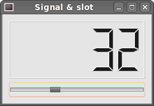
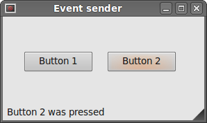

# Events and Signals in PySide

In this part of the PySide programming tutorial, we will explore events and signals occurring in applications.  

## Events

Events are an important part in any GUI program. Events are generated by users or by the system. When we call the application's exec_() method, the application enters the main loop. The main loop fetches events and sends them to the objects. PySide has a unique signal and slot mechanism.  

All GUI applications are event-driven. An application reacts to different event types which are generated during its life. Events are generated mainly by the user of an application. But they can be generated by other means as well. e.g. Internet connection, window manager, timer. In the event model, there are three participants:  

- event source
- event object
- event target

The `event source` is the object whose state changes. It generates events. The event object (Event) encapsulates the state changes in the event source. The `event target` is the object that wants to be notified. Event source object delegates the task of handling an event to the event target.  

When we call the application's `exec_()` method, the application enters the main loop. The main loop fetches events and sends them to the objects. Signals and slots are used for communication between objects. A signal is emitted when a particular event occurs. A slot can be any Python callable. A slot is called when a signal connected to it is emitted.  

## Signals & Slots

This is a simple example, demonstrating signals and slots in PySide.  

```python
#!/usr/bin/python
# -*- coding: utf-8 -*-

"""
ZetCode PySide tutorial 

In this example, we connect a signal
of a QtGui.QSlider to a slot 
of a QtGui.QLCDNumber. 

author: Jan Bodnar
website: zetcode.com 
last edited: August 2011
"""

import sys
from PySide import QtGui, QtCore

class Example(QtGui.QWidget):
    
    def __init__(self):
        super(Example, self).__init__()
        
        self.initUI()
        
    def initUI(self):
        
        lcd = QtGui.QLCDNumber(self)
        sld = QtGui.QSlider(QtCore.Qt.Horizontal, self)

        vbox = QtGui.QVBoxLayout()
        vbox.addWidget(lcd)
        vbox.addWidget(sld)

        self.setLayout(vbox)
        sld.valueChanged.connect(lcd.display)
        
        self.setGeometry(300, 300, 250, 150)
        self.setWindowTitle('Signal & slot')
        self.show()
        
def main():
    
    app = QtGui.QApplication(sys.argv)
    ex = Example()
    sys.exit(app.exec_())


if __name__ == '__main__':
    main()
```

In our example, we display a QtGui.QLCDNumber and a QtGui.QSlider. We change the lcd number by dragging the slider knob.  

```python
sld.valueChanged.connect(lcd.display)
```

Here we connect a valueChanged signal of the slider to the display slot of the lcd number.  

The sender is an object that sends a signal. The receiver is the object, that receives the signal. The slot is the method that reacts to the signal.  


Figure: Signal & slot  

## Reimplementing event handler

Events in PySide are processed often by reimplementing event handlers.  

```python
#!/usr/bin/python
# -*- coding: utf-8 -*-

"""
ZetCode PySide tutorial 

In this example, we reimplement an 
event handler. 

author: Jan Bodnar
website: zetcode.com 
last edited: August 2011
"""

import sys
from PySide import QtGui, QtCore

class Example(QtGui.QWidget):
    
    def __init__(self):
        super(Example, self).__init__()
        
        self.initUI()
        
    def initUI(self):      
        
        self.setGeometry(300, 300, 250, 150)
        self.setWindowTitle('Event handler')
        self.show()
        
    def keyPressEvent(self, e):
        
        if e.key() == QtCore.Qt.Key_Escape:
            self.close()
        
def main():
    
    app = QtGui.QApplication(sys.argv)
    ex = Example()
    sys.exit(app.exec_())


if __name__ == '__main__':
    main()
```

In our example, we reimplement the keyPressEvent() event handler.  

```python
def keyPressEvent(self, e):
    
    if e.key() == QtCore.Qt.Key_Escape:
        self.close()
```

If we click the escape button, the application terminates.  

##  Event sender

Sometimes it is convenient to know, which widget is the sender of a signal. For this, PySide has a sender() method.  

```python
#!/usr/bin/python
# -*- coding: utf-8 -*-

"""
ZetCode PySide tutorial 

In this example, we determine the event sender
object.

author: Jan Bodnar
website: zetcode.com 
last edited: August 2011
"""

import sys
from PySide import QtGui, QtCore

class Example(QtGui.QMainWindow):
    
    def __init__(self):
        super(Example, self).__init__()
        
        self.initUI()
        
    def initUI(self):      

        btn1 = QtGui.QPushButton("Button 1", self)
        btn1.move(30, 50)

        btn2 = QtGui.QPushButton("Button 2", self)
        btn2.move(150, 50)
      
        btn1.clicked.connect(self.buttonClicked)            
        btn2.clicked.connect(self.buttonClicked)
        
        self.statusBar()
        
        self.setGeometry(300, 300, 290, 150)
        self.setWindowTitle('Event sender')
        self.show()
        
    def buttonClicked(self):
      
        sender = self.sender()
        self.statusBar().showMessage(sender.text() + ' was pressed')
        
def main():
    
    app = QtGui.QApplication(sys.argv)
    ex = Example()
    sys.exit(app.exec_())


if __name__ == '__main__':
    main()
```

We have two buttons in our example. In the buttonClicked() method we determine, which button we have clicked by calling the sender() method.  

```python
btn1.clicked.connect(self.buttonClicked)            
btn2.clicked.connect(self.buttonClicked)
```

Both buttons are connected to the same slot.  

```python
def buttonClicked(self):
  
    sender = self.sender()
    self.statusBar().showMessage(sender.text() + ' was pressed')
```

We determine the signal source by calling the sender() method. In the statusbar of the application, we show the label of the button being pressed.  


Figure: Event sender  

## Emitting signals 发射信号

Objects created from QtCore.QObject can emit signals. If we click on the button, a clicked signal is generated. In the following example we will see, how we can emit a custom signal.  

创建自QtCore.QObject的对象可以发射信号。如果我们点击按钮，clicked信号就会生成。在下面的例子中我们可以看到，如何发射一个自定义信号。  

```python
#!/usr/bin/python
# -*- coding: utf-8 -*-

"""
ZetCode PySide tutorial 

In this example, we show how to emit a
signal. 

author: Jan Bodnar
website: zetcode.com 
last edited: August 2011
"""

import sys
from PySide import QtGui, QtCore

class Communicate(QtCore.QObject):
    
    closeApp = QtCore.Signal()

class Example(QtGui.QMainWindow):
    
    def __init__(self):
        super(Example, self).__init__()
        
        self.initUI()
        
    def initUI(self):      

        self.c = Communicate()
        self.c.closeApp.connect(self.close)       
        
        self.setGeometry(300, 300, 290, 150)
        self.setWindowTitle('Emit signal')
        self.show()
        
    def mousePressEvent(self, event):
        
        self.c.closeApp.emit()
        
def main():
    
    app = QtGui.QApplication(sys.argv)
    ex = Example()
    sys.exit(app.exec_())


if __name__ == '__main__':
    main()
```

We create a new signal called closeApp. This signal is emitted, during a mouse press event. The signal is connected to the close() slot of the QtGui.QMainWindow.  

```python
class Communicate(QtCore.QObject):
    
    closeApp = QtCore.Signal()
```

We create a class based on a QtCore.QObject. It creates a closeApp signal when instantiated.  

```python
self.c = Communicate()
self.c.closeApp.connect(self.close)
```

An instance of the Communicate class is created. We connect a close() slot of the QtGui.QMainWindow to the closeApp signal.  

```python
def mousePressEvent(self, event):
    
    self.c.closeApp.emit()
```

When we click on the window with a mouse pointer, the closeApp signal is emitted.  

In this part of the PySide tutorial, we have covered signals and slots.  

