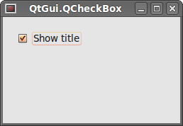
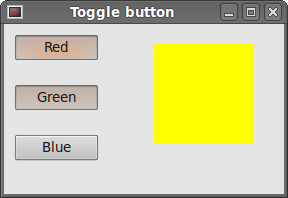
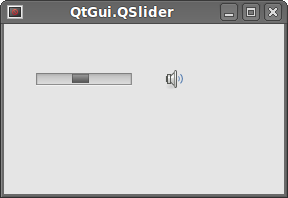
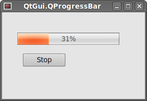
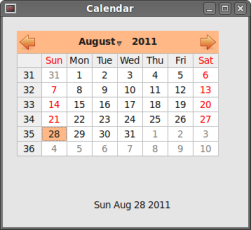

# PySide widgets

Widgets are basic building blocks of an application. The PySide programming toolkit has a wide range of various widgets. Buttons, check boxes, sliders, list boxes etc. Everything a programmer needs for his job. In this section of the tutorial, we will describe several useful widgets. Namely QtGui.QCheckBox, ToggleButton, QtGui.QSlider, QtGui.QProgressBar and a QtGui.QCalendarWidget.  

## QtGui.QCheckBox

QtGui.QCheckBox is a widget that has two states: on and off. It is a box with a label. Check boxes are typically used to represent features in an application that can be enabled or disabled without affecting others.  

```python
#!/usr/bin/python
# -*- coding: utf-8 -*-

"""
ZetCode PySide tutorial 

In this example, a QtGui.QCheckBox widget
is used to toggle the title of a window.

author: Jan Bodnar
website: zetcode.com 
last edited: August 2011
"""

import sys
from PySide import QtGui, QtCore

class Example(QtGui.QWidget):
    
    def __init__(self):
        super(Example, self).__init__()
        
        self.initUI()
        
    def initUI(self):      

        cb = QtGui.QCheckBox('Show title', self)
        cb.move(20, 20)
        cb.toggle()
        cb.stateChanged.connect(self.changeTitle)
        
        self.setGeometry(300, 300, 250, 150)
        self.setWindowTitle('QtGui.QCheckBox')
        self.show()
        
    def changeTitle(self, state):
      
        if state == QtCore.Qt.Checked:
            self.setWindowTitle('Checkbox')
        else:
            self.setWindowTitle('')
        
def main():
    
    app = QtGui.QApplication(sys.argv)
    ex = Example()
    sys.exit(app.exec_())


if __name__ == '__main__':
    main()
```

In our example, we will create a checkbox that will toggle the window title.  

```python
cb = QtGui.QCheckBox('Show title', self)
```

This is the QtGui.QCheckBox constructor.  

```python
cb.toggle()
```

We set the window title, so we must also check the checkbox.  

```python
cb.stateChanged.connect(self.changeTitle)
```

We connect the user defined changeTitle() method to the stateChanged signal. The changeTitle() method will toggle the window title.  

```python
def changeTitle(self, state):
  
    if state == QtCore.Qt.Checked:
        self.setWindowTitle('Checkbox')
    else:
        self.setWindowTitle('')
```

We receive the state of the check box in the state variable. If it is set, we set a title of the window. Otherwise, we use an empty string as a title.  


Figure: QtGui.QCheckBox  

## ToggleButton

PySide has no widget for a ToggleButton. To create a ToggleButton, we use a QtGui.QPushButton in a special mode. ToggleButton is a button that has two states. Pressed and not pressed. You toggle between these two states by clicking on it. There are situations where this functionality fits well.  

```python
#!/usr/bin/python
# -*- coding: utf-8 -*-

"""
ZetCode PySide tutorial 

In this example, we create three toggle buttons.
They will control the background color of a 
QtGui.QFrame. 

author: Jan Bodnar
website: zetcode.com 
last edited: August 2011
"""

import sys
from PySide import QtGui, QtCore

class Example(QtGui.QWidget):
    
    def __init__(self):
        super(Example, self).__init__()
        
        self.initUI()
        
    def initUI(self):      

        self.col = QtGui.QColor(0, 0, 0)       

        redb = QtGui.QPushButton('Red', self)
        redb.setCheckable(True)
        redb.move(10, 10)

        redb.clicked[bool].connect(self.setColor)

        greenb = QtGui.QPushButton('Green', self)
        greenb.setCheckable(True)
        greenb.move(10, 60)

        greenb.clicked[bool].connect(self.setColor)

        blueb = QtGui.QPushButton('Blue', self)
        blueb.setCheckable(True)
        blueb.move(10, 110)

        blueb.clicked[bool].connect(self.setColor)

        self.square = QtGui.QFrame(self)
        self.square.setGeometry(150, 20, 100, 100)
        self.square.setStyleSheet("QWidget { background-color: %s }" %  
            self.col.name())
        
        self.setGeometry(300, 300, 280, 170)
        self.setWindowTitle('Toggle button')
        self.show()
        
    def setColor(self, pressed):
        
        source = self.sender()
        
        if pressed:
            val = 255
        else: val = 0
                        
        if source.text() == "Red":
            self.col.setRed(val)                
        elif source.text() == "Green":
            self.col.setGreen(val)             
        else:
            self.col.setBlue(val) 
            
        self.square.setStyleSheet("QFrame { background-color: %s }" %
            self.col.name())  
        
def main():
    
    app = QtGui.QApplication(sys.argv)
    ex = Example()
    sys.exit(app.exec_())


if __name__ == '__main__':
    main()
```

In our example, we create three ToggleButtons. We also create a QtGui.QFrame widget. We set the background colour of the widget to black. The togglebuttons will toggle the red, green and blue parts of a colour value. The background colour will depend on which togglebuttons we have pressed.  

```python
self.col = QtGui.QColor(0, 0, 0)
```

This is the initial color value. It is black.  

```python
greenb = QtGui.QPushButton('Green', self)
greenb.setCheckable(True)
```

To create a ToggleButton, we create a QtGui.QPushButton and make it checkable by calling the setCheckable() method.  

```python
greenb.clicked[bool].connect(self.setColor)
```

We connect a clicked[bool] signal to our user defined method. Note that this signal type sends a bool argument to the method. The argument value is true or false, depending on the state of the button, e.g. if it is checked/toggled or not.  

```python
source = self.sender()
```

We get the sender of the signal. It is the button which was toggled.  

```python
if source.text() == "Red":
    self.col.setRed(val)
```

In case it was a red button, we update the red part of the colour accordingly.  

```python
self.square.setStyleSheet("QFrame { background-color: %s }" %
    self.col.name())
```

We use stylesheets to change the background colour of the QtGui.QFrame widget.  


Figure: ToggleButton  

## QtGui.QSlider

QtGui.QSlider is a widget that has a simple handle. This handle can be pulled back and forth. This way we are choosing a value for a specific task. Sometimes using a slider is more natural, than simply providing a number or using a spin box. QtGui.QLabel displays text or image.  

In our example we will show one slider and one label. This time, the label will display an image. The slider will control the label.  

```python
#!/usr/bin/python
# -*- coding: utf-8 -*-

"""
ZetCode PySide tutorial 

This example shows a QtGui.QSlider widget.

author: Jan Bodnar
website: zetcode.com 
last edited: August 2011
"""

import sys
from PySide import QtGui, QtCore

class Example(QtGui.QWidget):
    
    def __init__(self):
        super(Example, self).__init__()
        
        self.initUI()
        
    def initUI(self):      

        sld = QtGui.QSlider(QtCore.Qt.Horizontal, self)
        sld.setFocusPolicy(QtCore.Qt.NoFocus)
        sld.setGeometry(30, 40, 100, 30)
        sld.valueChanged[int].connect(self.changeValue)
        
        self.label = QtGui.QLabel(self)
        self.label.setPixmap(QtGui.QPixmap('mute.png'))
        self.label.setGeometry(160, 40, 80, 30)
        
        self.setGeometry(300, 300, 280, 170)
        self.setWindowTitle('QtGui.QSlider')
        self.show()
        
    def changeValue(self, value):

        if value == 0:
            self.label.setPixmap(QtGui.QPixmap('mute.png'))
        elif value > 0 and value <= 30:
            self.label.setPixmap(QtGui.QPixmap('min.png'))
        elif value > 30 and value < 80:
            self.label.setPixmap(QtGui.QPixmap('med.png'))
        else:
            self.label.setPixmap(QtGui.QPixmap('max.png'))
        
def main():
    
    app = QtGui.QApplication(sys.argv)
    ex = Example()
    sys.exit(app.exec_())


if __name__ == '__main__':
    main()
```

In our example we simulate a volume control. By dragging the handle of a slider, we change an image on the label.  

```python
sld = QtGui.QSlider(QtCore.Qt.Horizontal, self)
```

Here we create a horizontal QtGui.QSlider.  

```python
self.label = QtGui.QLabel(self)
self.label.setPixmap(QtGui.QPixmap('mute.png'))
```

We create a QtGui.QLabel widget. And set an initial mute image to it.  

```python
sld.valueChanged[int].connect(self.changeValue)
```

We connect the valueChanged[int] signal to the user defined changeValue() method.  

```python
if value == 0:
    self.label.setPixmap(QtGui.QPixmap('mute.png'))
...
```

Based on the value of the slider, we set an image to the label. In the above code, we set a mute.png image to the label if the slider value is equal to zero.  


Figure: QtGui.QSlider widget  

## QtGui.QProgressBar

A progress bar is a widget that is used, when we process lengthy tasks. It is animated so that the user knows that our task is progressing. The QtGui.QProgressBar widget provides a horizontal or vertical progress bar in PySide toolkit. The programmer can set the minimum and maximum values for the progress bar. The default values are 0, 99.  

```python
#!/usr/bin/python
# -*- coding: utf-8 -*-

"""
ZetCode PySide tutorial 

This example shows a QtGui.QProgressBar widget.

author: Jan Bodnar
website: zetcode.com 
last edited: August 2011
"""

import sys
from PySide import QtGui, QtCore

class Example(QtGui.QWidget):
    
    def __init__(self):
        super(Example, self).__init__()
        
        self.initUI()
        
    def initUI(self):      

        self.pbar = QtGui.QProgressBar(self)
        self.pbar.setGeometry(30, 40, 200, 25)

        self.btn = QtGui.QPushButton('Start', self)
        self.btn.move(40, 80)
        self.btn.clicked.connect(self.doAction)

        self.timer = QtCore.QBasicTimer()
        self.step = 0
        
        self.setGeometry(300, 300, 280, 170)
        self.setWindowTitle('QtGui.QProgressBar')
        self.show()
        
    def timerEvent(self, e):
      
        if self.step >= 100:
            self.timer.stop()
            self.btn.setText('Finished')
            return
        self.step = self.step + 1
        self.pbar.setValue(self.step)

    def doAction(self):
      
        if self.timer.isActive():
            self.timer.stop()
            self.btn.setText('Start')
        else:
            self.timer.start(100, self)
            self.btn.setText('Stop')
        
def main():
    
    app = QtGui.QApplication(sys.argv)
    ex = Example()
    sys.exit(app.exec_())


if __name__ == '__main__':
    main()
```

In our example we have a horizontal progress bar and a push button. The push button starts and stops the progress bar.  

```python
self.pbar = QtGui.QProgressBar(self)
```

This is a QtGui.QProgressBar constructor.  

```python
self.timer = QtCore.QBasicTimer()
```

To activate the progress bar, we use the timer object.  

```python
self.timer.start(100, self)
```

To launch the timer events, we call the start() method. This method has two parameters. The timeout and the object, which will receive the events.  

```python
def timerEvent(self, e):
  
    if self.step >= 100:
        self.timer.stop()
        self.btn.setText('Finished')
        return
    self.step = self.step + 1
    self.pbar.setValue(self.step)
```

Each QtCore.QObject and its descendants have a timerEvent() event handler. In order to react to timer events, we reimplement the event handler. We update the self.step variable and set a new value for the progress bar widget.  

```python
def doAction(self):
  
    if self.timer.isActive():
        self.timer.stop()
        self.btn.setText('Start')
    else:
        self.timer.start(100, self)
        self.btn.setText('Stop')
```

Inside the doAction() method, we start and stop the timer.  


Figure: QtGui.QProgressBar  

## QtGui.QCalendarWidget

The QtGui.QCalendarWidget provides a monthly based calendar widget. It allows a user to select a date in a simple and intuitive way.  

```python
#!/usr/bin/python
# -*- coding: utf-8 -*-

"""
ZetCode PySide tutorial 

This example shows a QtGui.QCalendarWidget widget.

author: Jan Bodnar
website: zetcode.com 
last edited: August 2011
"""

import sys
from PySide import QtGui, QtCore

class Example(QtGui.QWidget):
    
    def __init__(self):
        super(Example, self).__init__()
        
        self.initUI()
        
    def initUI(self):      

        cal = QtGui.QCalendarWidget(self)
        cal.setGridVisible(True)
        cal.move(20, 20)
        cal.clicked[QtCore.QDate].connect(self.showDate)
        
        self.lbl = QtGui.QLabel(self)
        date = cal.selectedDate()
        self.lbl.setText(date.toString())
        self.lbl.move(130, 260)
        
        self.setGeometry(300, 300, 350, 300)
        self.setWindowTitle('Calendar')
        self.show()
        
    def showDate(self, date):     
        self.lbl.setText(date.toString())
        
def main():
    
    app = QtGui.QApplication(sys.argv)
    ex = Example()
    sys.exit(app.exec_())


if __name__ == '__main__':
    main()
```

The example has a calendar widget and a label widget. The currently selected date is displayed in the label widget.  

```python
self.cal = QtGui.QCalendarWidget(self)
```

We construct a calendar widget.  

```python
cal.clicked[QtCore.QDate].connect(self.showDate)
```

If we select a date from the widget, a clicked[QtCore.QDate] signal is emitted. We connect this signal to the user defined showDate() method.  

```python
def showDate(self, date):     
    self.lbl.setText(date.toString())
```

We retrieve the selected date calling the selectedDate() method. Then we transform the date object into string and set it to the label widget.  


Figure: QtGui.QCalendarWidget widget  

In this part of the PySide tutorial, we covered several widgets.  

