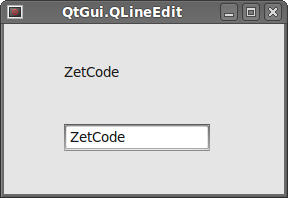
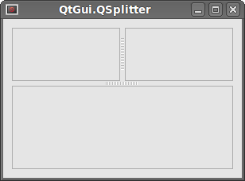
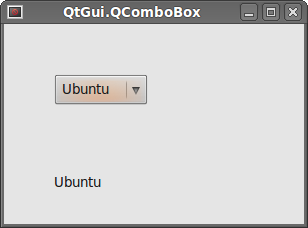

# PySide widgets II

Here we will continue introducing PySide widgets. We will cover QtGui.QPixmap, QtGui.QLineEdit, QtGui.QSplitter and QtGui.QComboBox.  

## QtGui.QPixmap

QtGui.QPixmap is one of the widgets used to work with images. It is optimised for showing images on screen. In our code example, we will use QtGui.QPixmap to display an image on the window.  

```python
#!/usr/bin/python
# -*- coding: utf-8 -*-

"""
ZetCode PySide tutorial 

In this example, we dispay an image
on the window. 

author: Jan Bodnar
website: zetcode.com 
last edited: August 2011
"""

import sys
from PySide import QtGui, QtCore

class Example(QtGui.QWidget):
    
    def __init__(self):
        super(Example, self).__init__()
        
        self.initUI()
        
    def initUI(self):      

        hbox = QtGui.QHBoxLayout(self)
        pixmap = QtGui.QPixmap("redrock.png")

        lbl = QtGui.QLabel(self)
        lbl.setPixmap(pixmap)

        hbox.addWidget(lbl)
        self.setLayout(hbox)
        
        self.setGeometry(300, 300, 280, 170)
        self.setWindowTitle('Red Rock')
        self.show()        
        
def main():
    
    app = QtGui.QApplication(sys.argv)
    ex = Example()
    sys.exit(app.exec_())


if __name__ == '__main__':
    main()
```

In our example, we display an image on the window. We use a QtGui.QPixmap to load an image from a file and QtGui.QLabel widget to display the image on the window.  

```python
pixmap = QtGui.QPixmap("redrock.png")
```

We create a QtGui.QPixmap object. It takes the name of the file as a parameter.  

```python
lbl = QtGui.QLabel(self)
lbl.setPixmap(pixmap)
```

We put the pixmap into the QtGui.QLabel widget.  

## QtGui.QLineEdit

QtGui.QLineEdit is a widget that allows to enter and edit a single line of plain text. There are undo/redo, cut/paste and drag & drop functions available for QtGui.QLineEdit widget.  

```python
#!/usr/bin/python
# -*- coding: utf-8 -*-

"""
ZetCode PySide tutorial 

This example shows text which 
is entered in a QtGui.QLineEdit
in a QtGui.QLabel widget.
 
author: Jan Bodnar
website: zetcode.com 
last edited: August 2011
"""

import sys
from PySide import QtGui, QtCore

class Example(QtGui.QWidget):
    
    def __init__(self):
        super(Example, self).__init__()
        
        self.initUI()
        
    def initUI(self):      

        self.lbl = QtGui.QLabel(self)
        qle = QtGui.QLineEdit(self)
        
        qle.move(60, 100)
        self.lbl.move(60, 40)

        qle.textChanged[str].connect(self.onChanged)
        
        self.setGeometry(300, 300, 280, 170)
        self.setWindowTitle('QtGui.QLineEdit')
        self.show()
        
    def onChanged(self, text):
        
        self.lbl.setText(text)
        self.lbl.adjustSize()        
        
        
def main():
    
    app = QtGui.QApplication(sys.argv)
    ex = Example()
    sys.exit(app.exec_())


if __name__ == '__main__':
    main()
```

This example shows a line edit widget and a label. The text that we key in the line edit is displayed immediately in the label widget.  

```python
qle = QtGui.QLineEdit(self)
```

The QtGui.QLineEdit widget is created.  

```python
qle.textChanged[str].connect(self.onChanged)
```

If the text in the line edit widget changes, we call the onChanged() method.  

```python
def onChanged(self, text):
    
    self.lbl.setText(text)
    self.lbl.adjustSize()
```

Inside the onChanged() method, we set the typed text to the label widget. We call the adjustSize() method to adjust the size of the label to the length of the text.  



Figure: QtGui.QLineEdit  

## QtGui.QSplitter

QtGui.QSplitter lets the user control the size of child widgets by dragging the boundary between the children. In our example, we show three QtGui.QFrame widgets organised with two splitters.  

```python
#!/usr/bin/python
# -*- coding: utf-8 -*-

"""
ZetCode PySide tutorial 

This example shows
how to use QtGui.QSplitter widget.
 
author: Jan Bodnar
website: zetcode.com 
last edited: August 2011
"""

import sys
from PySide import QtGui, QtCore

class Example(QtGui.QWidget):
    
    def __init__(self):
        super(Example, self).__init__()
        
        self.initUI()
        
    def initUI(self):      

        hbox = QtGui.QHBoxLayout(self)

        topleft = QtGui.QFrame(self)
        topleft.setFrameShape(QtGui.QFrame.StyledPanel)
 
        topright = QtGui.QFrame(self)
        topright.setFrameShape(QtGui.QFrame.StyledPanel)

        bottom = QtGui.QFrame(self)
        bottom.setFrameShape(QtGui.QFrame.StyledPanel)

        splitter1 = QtGui.QSplitter(QtCore.Qt.Horizontal)
        splitter1.addWidget(topleft)
        splitter1.addWidget(topright)

        splitter2 = QtGui.QSplitter(QtCore.Qt.Vertical)
        splitter2.addWidget(splitter1)
        splitter2.addWidget(bottom)

        hbox.addWidget(splitter2)
        self.setLayout(hbox)
        QtGui.QApplication.setStyle(QtGui.QStyleFactory.create('Cleanlooks'))
        
        self.setGeometry(300, 300, 300, 200)
        self.setWindowTitle('QtGui.QSplitter')
        self.show()
        
    def onChanged(self, text):
        
        self.lbl.setText(text)
        self.lbl.adjustSize()        
        
        
def main():
    
    app = QtGui.QApplication(sys.argv)
    ex = Example()
    sys.exit(app.exec_())


if __name__ == '__main__':
    main()
```

In our example we have three frame widgets and two splitters.  

```python
topleft = QtGui.QFrame(self)
topleft.setFrameShape(QtGui.QFrame.StyledPanel)
```

We use a styled frame in order to see boundaries between the QtGui.QFrame widgets.  

```python
splitter1 = QtGui.QSplitter(QtCore.Qt.Horizontal)
splitter1.addWidget(topleft)
splitter1.addWidget(topright)
```

We create a QtGui.QSplitter widget and add two frames into it.  

```python
splitter2 = QtGui.QSplitter(QtCore.Qt.Vertical)
splitter2.addWidget(splitter1)
```

We can also add splitter to another splitter widget.  

QtGui.QApplication.setStyle(QtGui.QStyleFactory.create('Cleanlooks'))
We use a Cleanlooks style. In some styles the frames are not visible.  



Figure: QtGui.QSplitter widget  

## QtGui.QComboBox

The QtGui.QComboBox is a widget that allows the user to choose from a list of options.  

```python
#!/usr/bin/python
# -*- coding: utf-8 -*-

"""
ZetCode PySide tutorial 

This example shows
how to use QtGui.QComboBox widget.
 
author: Jan Bodnar
website: zetcode.com 
last edited: August 2011
"""

import sys
from PySide import QtGui, QtCore

class Example(QtGui.QWidget):
    
    def __init__(self):
        super(Example, self).__init__()
        
        self.initUI()
        
    def initUI(self):      

        self.lbl = QtGui.QLabel("Ubuntu", self)

        combo = QtGui.QComboBox(self)
        combo.addItem("Ubuntu")
        combo.addItem("Mandriva")
        combo.addItem("Fedora")
        combo.addItem("Red Hat")
        combo.addItem("Gentoo")

        combo.move(50, 50)
        self.lbl.move(50, 150)

        combo.activated[str].connect(self.onActivated)        
         
        self.setGeometry(300, 300, 300, 200)
        self.setWindowTitle('QtGui.QComboBox')
        self.show()
        
    def onActivated(self, text):
      
        self.lbl.setText(text)
        self.lbl.adjustSize()  
                
def main():
    
    app = QtGui.QApplication(sys.argv)
    ex = Example()
    sys.exit(app.exec_())


if __name__ == '__main__':
    main()
```

The example shows a QtGui.QComboBox and a QtGui.QLabel. The combo box has a list of five options. These are the names of Linux distros. The label widget shows the selected option from the combo box.  

```python
combo = QtGui.QComboBox(self)
combo.addItem("Ubuntu")
combo.addItem("Mandriva")
combo.addItem("Fedora")
combo.addItem("Red Hat")
combo.addItem("Gentoo")
```

We create a QtGui.QComboBox widget and add five options into it.  

```python
combo.activated[str].connect(self.onActivated)
```

Upon an item selection, we call the onActivated() method.  

```python
def onActivated(self, text):
  
    self.lbl.setText(text)
    self.lbl.adjustSize()
```

Inside the method, we set the text of the chosen item to the label widget. We adjust the size of the label.  


Figure: QtGui.QComboBox  

In this part of the PySide tutorial, we covered other four PySide widgets.  

