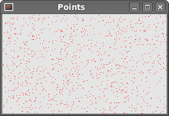
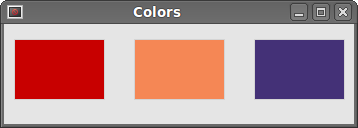
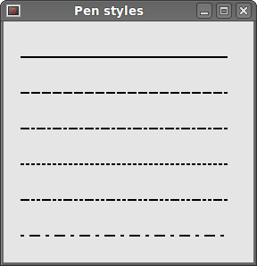
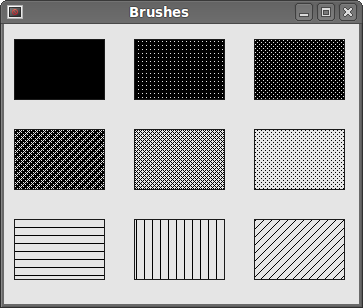

# Drawing in PySide

Drawing is used, when we want to change or enhance an existing widget. Or if we are creating a custom widget from scratch. To do the drawing, we use the drawing API provided by the PySide toolkit.  

The drawing is done within the paintEvent() method. The drawing code is placed between the begin() and end() methods of the QtGui.QPainter object.  

## Drawing text

We begin with drawing some Unicode text onto the window client area.  

```python
#!/usr/bin/python
# -*- coding: utf-8 -*-

"""
ZetCode PySide tutorial 

In this example, we draw text in Russian azbuka.

author: Jan Bodnar
website: zetcode.com 
last edited: August 2011
"""

import sys
from PySide import QtGui, QtCore

class Example(QtGui.QWidget):
    
    def __init__(self):
        super(Example, self).__init__()
        
        self.initUI()
        
    def initUI(self):      

        self.text = u'\u041b\u0435\u0432 \u041d\u0438\u043a\u043e\u043b\u0430\
\u0435\u0432\u0438\u0447 \u0422\u043e\u043b\u0441\u0442\u043e\u0439: \n\
\u0410\u043d\u043d\u0430 \u041a\u0430\u0440\u0435\u043d\u0438\u043d\u0430'

        self.setGeometry(300, 300, 280, 170)
        self.setWindowTitle('Draw text')
        self.show()

    def paintEvent(self, event):

        qp = QtGui.QPainter()
        qp.begin(self)
        self.drawText(event, qp)
        qp.end()
        
    def drawText(self, event, qp):
      
        qp.setPen(QtGui.QColor(168, 34, 3))
        qp.setFont(QtGui.QFont('Decorative', 10))
        qp.drawText(event.rect(), QtCore.Qt.AlignCenter, self.text)        
                
        
def main():
    
    app = QtGui.QApplication(sys.argv)
    ex = Example()
    sys.exit(app.exec_())


if __name__ == '__main__':
    main()
```

In our example, we draw some text in Azbuka. The text is vertically and horizontally aligned.  

```python
def paintEvent(self, event):
```

Drawing is done within a paint event.  

```python
qp = QtGui.QPainter()
qp.begin(self)
self.drawText(event, qp)
qp.end()
```

The QtGui.QPainter class is responsible for all the low-level painting. All the painting methods go between begin() and end() methods. The actual painting is delegated to the drawText() method.  

```python
qp.setPen(QtGui.QColor(168, 34, 3))
qp.setFont(QtGui.QFont('Decorative', 10))
```

Here we define pen and font which we use to draw the text.  

```python
qp.drawText(event.rect(), QtCore.Qt.AlignCenter, self.text)
```

The drawText() method draws text on the window. The rect() method of the paint event returns the rectangle that needs to be updated.  


Figure: Drawing Text  

## Drawing points

A point is the most simple graphics object that can be drawn. It is a small spot on the window.  

```python
#!/usr/bin/python
# -*- coding: utf-8 -*-

"""
ZetCode PySide tutorial 

In the example, we draw randomly 1000 red points 
on the window.

author: Jan Bodnar
website: zetcode.com 
last edited: August 2011
"""

import sys, random
from PySide import QtGui, QtCore

class Example(QtGui.QWidget):
    
    def __init__(self):
        super(Example, self).__init__()
        
        self.initUI()
        
    def initUI(self):      

        self.setGeometry(300, 300, 280, 170)
        self.setWindowTitle('Points')
        self.show()

    def paintEvent(self, e):

        qp = QtGui.QPainter()
        qp.begin(self)
        self.drawPoints(qp)
        qp.end()
        
    def drawPoints(self, qp):
      
        qp.setPen(QtCore.Qt.red)
        size = self.size()
        
        for i in range(1000):
            x = random.randint(1, size.width()-1)
            y = random.randint(1, size.height()-1)
            qp.drawPoint(x, y)     
                
        
def main():
    
    app = QtGui.QApplication(sys.argv)
    ex = Example()
    sys.exit(app.exec_())


if __name__ == '__main__':
    main()
```

In our example, we draw randomly 1000 red points on the client area.  
 
```python
qp.setPen(QtCore.Qt.red)
```

We set the pen to red colour. We use a predefined colour constant.  

```python
size = self.size()
```

Each time we resize the window, a paint event is generated. We get the current size of the window with the size() method. We use the size of the window to distribute the points all over the client area of the window.  

```python
qp.drawPoint(x, y) 
```

We draw the point with the drawPoint() method.  


Figure: Points  

## Colors

A colour is an object representing a combination of Red, Green, and Blue (RGB) intensity values. Valid RGB values are in the range 0 to 255. We can define a colour in various ways. The most common are RGB decimal values or hexadecimal values. We can also use an RGBA value, which stands for Red, Green, Blue, Alpha. Here we add some extra information, regarding transparency. Alpha value of 255 defines full opacity, 0 is for full transparency, e.g. the colour is invisible.  

```python
#!/usr/bin/python
# -*- coding: utf-8 -*-

"""
ZetCode PySide tutorial 

This example draws three rectangles in three
different colors. 

author: Jan Bodnar
website: zetcode.com 
last edited: August 2011
"""

import sys
from PySide import QtGui, QtCore

class Example(QtGui.QWidget):
    
    def __init__(self):
        super(Example, self).__init__()
        
        self.initUI()
        
    def initUI(self):      

        self.setGeometry(300, 300, 350, 100)
        self.setWindowTitle('Colors')
        self.show()

    def paintEvent(self, e):

        qp = QtGui.QPainter()
        qp.begin(self)
        self.drawRectangles(qp)
        qp.end()
        
    def drawRectangles(self, qp):
      
        color = QtGui.QColor(0, 0, 0)
        color.setNamedColor('#d4d4d4')
        qp.setPen(color)

        qp.setBrush(QtGui.QColor(200, 0, 0))
        qp.drawRect(10, 15, 90, 60)

        qp.setBrush(QtGui.QColor(255, 80, 0, 160))
        qp.drawRect(130, 15, 90, 60)

        qp.setBrush(QtGui.QColor(25, 0, 90, 200))
        qp.drawRect(250, 15, 90, 60)
              
        
def main():
    
    app = QtGui.QApplication(sys.argv)
    ex = Example()
    sys.exit(app.exec_())


if __name__ == '__main__':
    main()
```

In our example, we draw 3 colored rectangles.  

```python
color = QtGui.QColor(0, 0, 0)
color.setNamedColor('#d4d4d4')
```

Here we define a color using a hexadecimal notation.  

```python
qp.setPen(color)
```

The above defined color is used for pen, which is used to draw outlines of shapes.  

```python
qp.setBrush(QtGui.QColor(200, 0, 0))
qp.drawRect(10, 15, 90, 60)
```

Here we define a brush and draw a rectangle. A brush is an elementary graphics object, which is used to draw the background of a shape. The drawRect() method accepts four parameters. The first two are x, y values on the axis. The third and fourth parameters are width and height of the rectangle. The method draws a rectangle using current pen and current brush.  


Figure: Colors  

## QtGui.QPen

QtGui.QPen is an elementary graphics object. It is used to draw lines, curves and outlines of rectangles, ellipses, polygons, or other shapes.  

```python
#!/usr/bin/python
# -*- coding: utf-8 -*-

"""
ZetCode PySide tutorial 

This example draws three rectangles in three
different colors. 

author: Jan Bodnar
website: zetcode.com 
last edited: August 2011
"""

import sys
from PySide import QtGui, QtCore

class Example(QtGui.QWidget):
    
    def __init__(self):
        super(Example, self).__init__()
        
        self.initUI()
        
    def initUI(self):      

        self.setGeometry(300, 300, 280, 270)
        self.setWindowTitle('Pen styles')
        self.show()

    def paintEvent(self, e):

        qp = QtGui.QPainter()
        qp.begin(self)
        self.drawLines(qp)
        qp.end()
        
    def drawLines(self, qp):
      
        pen = QtGui.QPen(QtCore.Qt.black, 2, QtCore.Qt.SolidLine)

        qp.setPen(pen)
        qp.drawLine(20, 40, 250, 40)

        pen.setStyle(QtCore.Qt.DashLine)
        qp.setPen(pen)
        qp.drawLine(20, 80, 250, 80)

        pen.setStyle(QtCore.Qt.DashDotLine)
        qp.setPen(pen)
        qp.drawLine(20, 120, 250, 120)

        pen.setStyle(QtCore.Qt.DotLine)
        qp.setPen(pen)
        qp.drawLine(20, 160, 250, 160)

        pen.setStyle(QtCore.Qt.DashDotDotLine)
        qp.setPen(pen)
        qp.drawLine(20, 200, 250, 200)

        pen.setStyle(QtCore.Qt.CustomDashLine)
        pen.setDashPattern([1, 4, 5, 4])
        qp.setPen(pen)
        qp.drawLine(20, 240, 250, 240)
              
        
def main():
    
    app = QtGui.QApplication(sys.argv)
    ex = Example()
    sys.exit(app.exec_())


if __name__ == '__main__':
    main()
```

In our example, we draw six lines. The lines are drawn in six different pen styles. There are five predefined pen styles. We can create also custom pen styles. The last line is drawn using custom pen style.  

```python
pen = QtGui.QPen(QtCore.Qt.black, 2, QtCore.Qt.SolidLine)
```

We create a QtGui.QPen object. The color is black. The width is set to 2 pixels, so that we can see the differences between the pen styles. The QtCore.Qt.SolidLine is one of the predefined pen styles.  

```python
pen.setStyle(QtCore.Qt.CustomDashLine)
pen.setDashPattern([1, 4, 5, 4])
qp.setPen(pen)
```

Here we define a custom pen style. We set a QtCore.Qt.CustomDashLine pen style and call a setDashPattern() method. The list of numbers defines a style. There must be an even number of numbers. Odd numbers define a dash, even numbers space. The greater the number, the greater the space or the dash. Our pattern is 1px dash 4px space 5px dash 4px space etc.  


Figure: Pen Styles  

## QtGui.QBrush

QtGui.QBrush is an elementary graphics object. It is used to paint the background of graphics shapes, such as rectangles, ellipses or polygons. A brush can be of three different types. A predefined brush a gradient or a texture pattern.  

```python
#!/usr/bin/python
# -*- coding: utf-8 -*-

"""
ZetCode PySide tutorial 

This example draws 9 rectangles in different
brush styles.

author: Jan Bodnar
website: zetcode.com 
last edited: August 2011
"""

import sys
from PySide import QtGui, QtCore

class Example(QtGui.QWidget):
    
    def __init__(self):
        super(Example, self).__init__()
        
        self.initUI()
        
    def initUI(self):      

        self.setGeometry(300, 300, 355, 280)
        self.setWindowTitle('Brushes')
        self.show()

    def paintEvent(self, e):

        qp = QtGui.QPainter()
        qp.begin(self)
        self.drawBrushes(qp)
        qp.end()
        
    def drawBrushes(self, qp):
      
        brush = QtGui.QBrush(QtCore.Qt.SolidPattern)
        qp.setBrush(brush)
        qp.drawRect(10, 15, 90, 60)

        brush.setStyle(QtCore.Qt.Dense1Pattern)
        qp.setBrush(brush)
        qp.drawRect(130, 15, 90, 60)

        brush.setStyle(QtCore.Qt.Dense2Pattern)
        qp.setBrush(brush)
        qp.drawRect(250, 15, 90, 60)

        brush.setStyle(QtCore.Qt.Dense3Pattern)
        qp.setBrush(brush)
        qp.drawRect(10, 105, 90, 60)

        brush.setStyle(QtCore.Qt.DiagCrossPattern)
        qp.setBrush(brush)
        qp.drawRect(10, 105, 90, 60)

        brush.setStyle(QtCore.Qt.Dense5Pattern)
        qp.setBrush(brush)
        qp.drawRect(130, 105, 90, 60)

        brush.setStyle(QtCore.Qt.Dense6Pattern)
        qp.setBrush(brush)
        qp.drawRect(250, 105, 90, 60)

        brush.setStyle(QtCore.Qt.HorPattern)
        qp.setBrush(brush)
        qp.drawRect(10, 195, 90, 60)

        brush.setStyle(QtCore.Qt.VerPattern)
        qp.setBrush(brush)
        qp.drawRect(130, 195, 90, 60)

        brush.setStyle(QtCore.Qt.BDiagPattern)
        qp.setBrush(brush)
        qp.drawRect(250, 195, 90, 60)
              
        
def main():
    
    app = QtGui.QApplication(sys.argv)
    ex = Example()
    sys.exit(app.exec_())


if __name__ == '__main__':
    main()
```

In our example, we draw nine different rectangles using 9 different brush styles.  

```python
brush = QtGui.QBrush(QtCore.Qt.SolidPattern)
qp.setBrush(brush)
qp.drawRect(10, 15, 90, 60)
```

We define a brush object. Set it to the painter object. And draw the rectangle calling the drawRect() method. It is the first rectangle shown on the picture.  


Figure: Brushes  

In this part of the PySide tutorial, we did some basic painting.  


