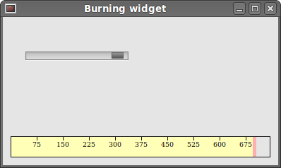

# Custom Widgets in PySide

PySide is rich on various widgets. No toolkit can provide all widgets that programmers might need in their applications. Toolkits usually provide only the most common widgets like buttons, text widgets, sliders etc. If there is a need for a more specialised widget, we must create it ourselves.  

Custom widgets are created by using the drawing tools provided by the toolkit. There are two possibilities. A programmer can modify or enhance an existing widget. Or he can create a custom widget from scratch.  

## Burning widget

This is a widget that we can see in Nero, K3B or other CD/DVD burning software. We create the widget completely from scratch. It is based on a minimal QtGui.QWidget widget.  

```python
#!/usr/bin/python
# -*- coding: utf-8 -*-

"""
ZetCode PySide tutorial 

In this example, we create a custom widget.

author: Jan Bodnar
website: zetcode.com 
last edited: August 2011
"""

import sys
from PySide import QtGui, QtCore

class Communicate(QtCore.QObject):
    
    updateBW = QtCore.Signal(int)

class BurningWidget(QtGui.QWidget):
  
    def __init__(self):      
        super(BurningWidget, self).__init__()
        
        self.initUI()
        
    def initUI(self):
        
        self.setMinimumSize(1, 30)
        self.value = 75
        self.num = [75, 150, 225, 300, 375, 450, 525, 600, 675]        


    def setValue(self, value):

        self.value = value


    def paintEvent(self, e):
      
        qp = QtGui.QPainter()
        qp.begin(self)
        self.drawWidget(qp)
        qp.end()
      
      
    def drawWidget(self, qp):
      
        font = QtGui.QFont('Serif', 7, QtGui.QFont.Light)
        qp.setFont(font)

        size = self.size()
        w = size.width()
        h = size.height()

        step = int(round(w / 10.0))


        till = int(((w / 750.0) * self.value))
        full = int(((w / 750.0) * 700))

        if self.value >= 700:
            qp.setPen(QtGui.QColor(255, 255, 255))
            qp.setBrush(QtGui.QColor(255, 255, 184))
            qp.drawRect(0, 0, full, h)
            qp.setPen(QtGui.QColor(255, 175, 175))
            qp.setBrush(QtGui.QColor(255, 175, 175))
            qp.drawRect(full, 0, till-full, h)
        else:
            qp.setPen(QtGui.QColor(255, 255, 255))
            qp.setBrush(QtGui.QColor(255, 255, 184))
            qp.drawRect(0, 0, till, h)


        pen = QtGui.QPen(QtGui.QColor(20, 20, 20), 1, 
            QtCore.Qt.SolidLine)
            
        qp.setPen(pen)
        qp.setBrush(QtCore.Qt.NoBrush)
        qp.drawRect(0, 0, w-1, h-1)

        j = 0

        for i in range(step, 10*step, step):
          
            qp.drawLine(i, 0, i, 5)
            metrics = qp.fontMetrics()
            fw = metrics.width(str(self.num[j]))
            qp.drawText(i-fw/2, h/2, str(self.num[j]))
            j = j + 1

class Example(QtGui.QWidget):
    
    def __init__(self):
        super(Example, self).__init__()
        
        self.initUI()
        
    def initUI(self):      

        sld = QtGui.QSlider(QtCore.Qt.Horizontal, self)
        sld.setFocusPolicy(QtCore.Qt.NoFocus)
        sld.setRange(1, 750)
        sld.setValue(75)
        sld.setGeometry(30, 40, 150, 30)

        self.c = Communicate()
        self.wid = BurningWidget()
        self.c.updateBW[int].connect(self.wid.setValue)        

        sld.valueChanged[int].connect(self.changeValue)
        hbox = QtGui.QHBoxLayout()
        hbox.addWidget(self.wid)
        vbox = QtGui.QVBoxLayout()
        vbox.addStretch(1)
        vbox.addLayout(hbox)
        self.setLayout(vbox)
        
        self.setGeometry(300, 300, 390, 210)
        self.setWindowTitle('Burning widget')
        self.show()
        
    def changeValue(self, value):
             
        self.c.updateBW.emit(value)
        self.wid.repaint()
        
def main():
    
    app = QtGui.QApplication(sys.argv)
    ex = Example()
    sys.exit(app.exec_())


if __name__ == '__main__':
    main()
```

In our example, we have a QtGui.QSlider and a custom widget. The slider controls the custom widget. This widget shows graphically the total capacity of a medium and the free space available to us. The minimum value of our custom widget is 1, the maximum is 750. If we reach value 700, we begin drawing in red colour. This normally indicates overburning.  

The burning widget is placed at the bottom of the window. This is achieved using one QtGui.QHBoxLayout and one QtGui.QVBoxLayout  

```python
class BurningWidget(QtGui.QWidget):
  
    def __init__(self):      
        super(BurningWidget, self).__init__()
```

The burning widget it based on the QtGui.QWidget widget.  

```python
self.setMinimumSize(1, 30)
```

We change the minimum size (height) of the widget. The default value is a bit small for us.  

```python
font = QtGui.QFont('Serif', 7, QtGui.QFont.Light)
qp.setFont(font)
```

We use a smaller font than the default one. That better suits our needs.  

```python
size = self.size()
w = size.width()
h = size.height()

step = int(round(w / 10.0))


till = int(((w / 750.0) * self.value))
full = int(((w / 750.0) * 700))
```

We draw the widget dynamically. The greater the window, the greater the burning widget. And vice versa. That is why we must calculate the size of the widget onto which we draw the custom widget. The till parameter determines the total size to be drawn. This value comes from the slider widget. It is a proportion of the whole area. The full parameter determines the point, where we begin to draw in red colour. Notice the use of floating point arithmetics. This is to achieve greater precision.  

The actual drawing consists of three steps. We draw the yellow or red and yellow rectangle. Then we draw the vertical lines, which divide the widget into several parts. Finally, we draw the numbers, which indicate the capacity of the medium.  

```python
metrics = qp.fontMetrics()
fw = metrics.width(str(self.num[j]))
qp.drawText(i-fw/2, h/2, str(self.num[j]))
```

We use font metrics to draw the text. We must know the width of the text in order to center it around the vertical line.  

```python
def changeValue(self, value):
          
    self.c.updateBW.emit(value)
    self.wid.repaint()
```

When we move the slider, the changeValue() method is called. Inside the method, we send a custom updateBW signal with a parameter. The parameter is the current value of the slider. The value is later used to calculate the capacity of the Burning widget to be drawn. The custom widget is then repainted.  


Figure: The Burning widget  

In this part of the PySide tutorial, we created a custom widget.  


