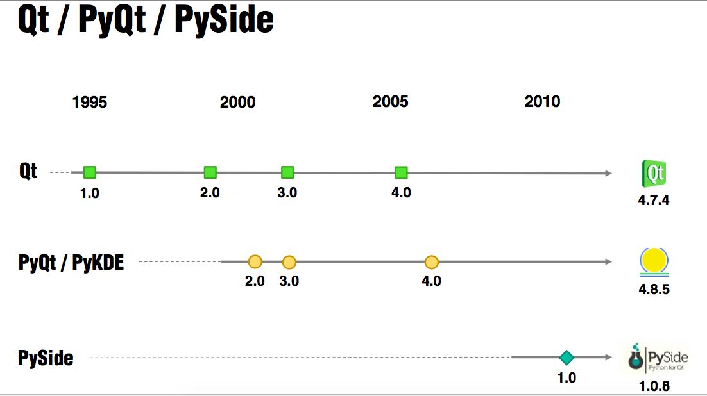

# Qt / PyQt / PySide 发展图谱

# PySide-PyQt-Tutorial
 
这是一份完整的基于Qt的针对Python，即，PySide和PyQt的教程。此教程由Jason Fruit授权，他从2000年就开始使用Python工作。实际上，他太爱Python了，甚至用给自己的小孩取名Python。  

本系列来自：http://pythoncentral.io/series/python-pyside-pyqt-tutorial/  

教程内容：  

- Part 0: Python GUI开发概览：GUI框架比较
- Part 1: 介绍 PyQt 和 PySide
- Part 2: 在Windows, Mac 和 Linux上安装PySide和PyQt
- Part 3: 介绍PySide/PyQt：基础部件和Hello, World!
- Part 4: PySide/PyQt 教程: 交互式部件和布局容器Interactive Widgets and Layout Containers
- Part 5: PySide/PyQt 教程: 使用内建信号和插槽
- Part 6: PySide/PyQt 教程: 创建自己的信号和插槽Creating Your Own Signals and Slots
- Part 7: PySide/PyQt 教程: 部件 QListWidget
- Part 8: PySide/PyQT 教程: QListView 和 QStandardItemModel

# PyQt-Tutorial

本系列来自: http://www.tutorialspoint.com/pyqt/

# PyQt5-tutorial

本系列来自: http://zetcode.com/gui/pyqt5/

本PyQt5教程适用于新手以及中级水平的程序员。学习本教程之后，你能够编写普通的PyQt5应用。  

教程内容：  

- 引言
- 第一个程序
- 菜单和工具条
- 布局管理
- 事件和信号
- 对话
- 部件
- 部件（二）
- 拖拽
- 画图
- 自定义部件
- 游戏：俄罗斯方块

# PyQt5-Beginner-tutorial

本系列来自：http://www.thehackeruniversity.com/category/pyqt5-tutorials/

# Building-a-text-editor-with-PyQt

本系列来自：https://github.com/goldsborough/Writer-Tutorial

编辑器实现的功能有:  

- 文件管理
- 富文本格式化
- 表格插入与管理
- 查找和替换
- 插入图片

- 第一部分: http://www.binpress.com/tutorial/building-a-text-editor-with-pyqt-part-one/143

- 第二部分: http://www.binpress.com/tutorial/developing-a-pyqt-text-editor-part-2/145

- 第三部分: http://www.binpress.com/tutorial/building-a-text-editor-with-pyqt-part-3/147

- 第四部分: http://www.binpress.com/tutorial/building-a-text-editor-with-pyqt-part-4/148
